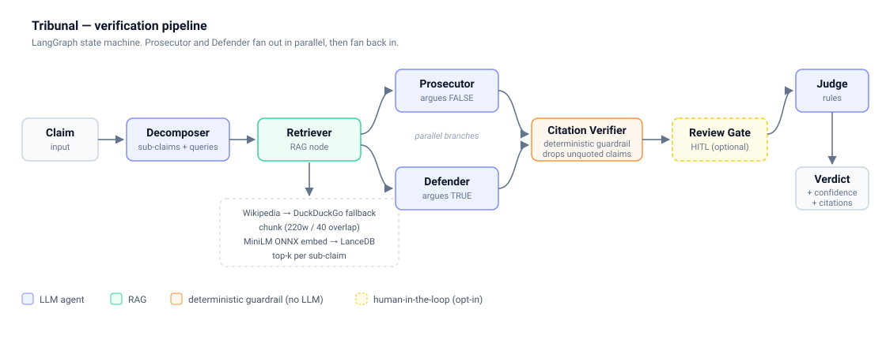

# Tribunal

Tribunal fact-checks a claim by making two LLM agents argue opposite sides of it, verifying their
citations against retrieved sources programmatically, and having a third agent rule on the result.

You give it a claim. It returns a verdict — `True`, `False`, `Misleading`, or `Unverifiable` — with a
confidence score and quotes traced back to the sources they came from.

```
$ tribunal "The Great Wall of China is visible from space with the naked eye"

  VERDICT: False  (confidence 90%)
  The Great Wall is not visible from space with the naked eye, per multiple astronaut accounts.

  Citations:
   [-] "Despite myths to the contrary, the wall isn't visible from the moon, and is difficult
        or impossible to see from Earth orbit without the high-powered lenses used..."
       https://www.nasa.gov/image-article/great-wall/
```

The design goal was to make the multi-agent structure load-bearing rather than decorative. A single
LLM asked "is this true?" tends to agree with the framing of the question. Forcing a prosecution and
a defense to each build the strongest case they can from the same evidence surfaces the conflict in
the sources instead of hiding it.

## Results

On a 12-claim golden set of common factual claims and myths:

| Metric | Value |
|---|---|
| Verdict accuracy | 10/12 (83%) |
| Typical latency | ~40s per claim |
| Cost | $0 (free-tier models) |

Of the two misses, one is a rate-limit error rather than a wrong answer, and the other is a
`Misleading` vs `False` disagreement on a claim where the label is arguable (*"Bananas grow on
trees"* — botanically the banana plant is a herb, so the model's `False` is defensible). The set is
small and hand-labeled; treat 83% as a smoke signal, not a benchmark.

## Architecture



Four LLM calls and one deterministic check per claim:

| Stage | Type | Responsibility |
|---|---|---|
| Decomposer | LLM (strong) | Splits the claim into atomic sub-claims and search queries |
| Retriever | RAG | Gathers sources, chunks, embeds, retrieves top-k per sub-claim |
| Prosecutor | LLM (fast) | Builds the strongest case that the claim is false |
| Defender | LLM (fast) | Builds the strongest case that the claim is true |
| Citation Verifier | deterministic | Drops any argument whose quote isn't in the evidence verbatim |
| Judge | LLM (strong) | Weighs the two verified briefs and rules |

Prosecutor and Defender run as parallel branches and fan back in — the Citation Verifier waits for
both. See [docs/WORKFLOW.md](docs/WORKFLOW.md) for a stage-by-stage walkthrough of a single request.

## Setup

```bash
uv venv && source .venv/bin/activate
uv pip install -e .          # add '.[dev]' for pytest
cp .env.example .env         # then fill in LLM_API_KEY
```

Tribunal talks to any OpenAI-compatible endpoint. Both of these work:

```bash
# OpenRouter
LLM_BASE_URL=https://openrouter.ai/api/v1
STRONG_MODEL=nvidia/nemotron-3-super-120b-a12b:free
FAST_MODEL=openai/gpt-oss-20b:free

# Google AI Studio
LLM_BASE_URL=https://generativelanguage.googleapis.com/v1beta/openai/
STRONG_MODEL=gemini-2.5-flash
FAST_MODEL=gemini-2.5-flash-lite
```

Embeddings run locally via ONNX, so no embedding API key is needed and no PyTorch is installed.

## Usage

Three interfaces over the same graph.

```bash
# CLI
tribunal "water boils at 100C at sea level"
tribunal --json "..."        # raw JSON
tribunal --review "..."      # pause for human input on low-confidence claims

# MCP server — exposes verify_claim to Claude Desktop, Cursor, or any MCP client
tribunal-mcp

# Web
uvicorn tribunal.web:app --reload    # http://127.0.0.1:8000
```

MCP client config:

```json
{
  "mcpServers": {
    "tribunal": { "command": "tribunal-mcp" }
  }
}
```

## Evaluation

```bash
python evals/run_evals.py
```

Runs every claim in `evals/golden.jsonl` and reports verdict accuracy against the expected label.
Claims that error (rate limits, timeouts) are reported as failures rather than silently skipped, so
the number never flatters itself.

## Observability

Set `LANGFUSE_PUBLIC_KEY` and `LANGFUSE_SECRET_KEY` to stream a hierarchical trace per claim — one
span per agent, with tokens, cost, latency, and the retrieved chunks that grounded each decision.
Leave them blank and the pipeline runs identically without tracing.

## Design decisions and tradeoffs

**The Citation Verifier is deterministic, not an LLM judge.** It normalizes whitespace and checks
that each argument's quote actually appears in a retrieved chunk, dropping it if not. Using a second
LLM to grade the first one's honesty just moves the trust problem; a string check can't hallucinate,
costs nothing, runs in microseconds, and is unit-testable. The tradeoff is brittleness — a model that
paraphrases rather than quotes loses arguments it might have been entitled to keep. Matching on a
60-character prefix softens that, but the guardrail is deliberately strict.

**Retrieval is just-in-time, not a prebuilt index.** Claims arrive unbounded, so there is no corpus to
index ahead of time. Each request fetches sources, builds an ephemeral LanceDB table, and discards it.
This costs latency and re-fetches on repeat claims — a persistent cache keyed by claim would fix that
and is the obvious next optimization.

**Wikipedia first, then web search.** Wikipedia is well-structured and stable, so it anchors most
claims cheaply. DuckDuckGo covers the rest without an API key. The cost is recency: neither source is
good on events from the last few days.

**Embeddings are local ONNX, inference is remote.** `fastembed` keeps embeddings free, offline, and
about 50 MB, versus roughly 2.5 GB for a PyTorch stack. The LLM calls go out to a hosted endpoint —
this was built on a machine that can't hold a useful local model in memory, and that constraint
turned out to be a reasonable production default anyway.

**Strong and fast models are split by role.** The Decomposer and Judge do the reasoning that decides
the outcome; the advocates mostly restate evidence. Splitting them cuts cost without measurably
hurting verdicts.

**Every model call retries and falls back.** Free-tier endpoints rate-limit constantly. Per-minute
limits get exponential backoff; daily quota exhaustion skips straight to a fallback model on a
separate quota, because waiting won't help.

## What I'd improve with more time

- Expand the golden set past 12 claims and add RAGAS faithfulness and context-precision scoring.
- Persist verified claims so repeat questions skip retrieval entirely.
- Let the Judge send a case back for more evidence instead of ruling `Unverifiable` on thin retrieval.
- Add source credibility weighting — right now a personal blog and NASA carry the same weight.
- Stream verdicts token by token in the web UI instead of blocking for ~40 seconds.

## Stack

LangGraph, Instructor, LanceDB, fastembed (ONNX MiniLM), FastMCP, FastAPI, Langfuse, uv.
