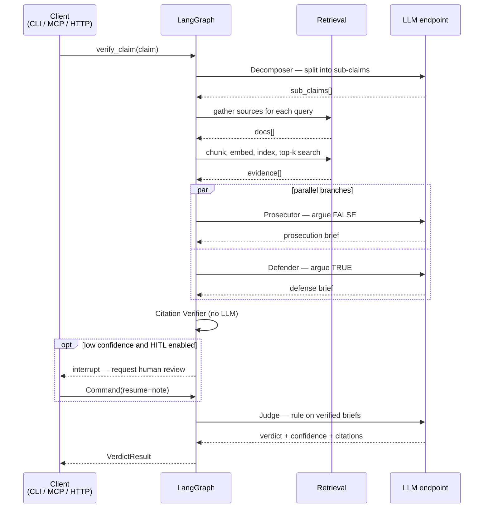

# Workflow

How a single claim moves through the service, stage by stage — what each node reads, what it writes,
what it costs, and how it fails.

## Request lifecycle



## State

Every node reads and writes one shared `TribunalState` dict. LangGraph merges partial updates, so
each node returns only the keys it owns.

| Key | Written by | Shape |
|---|---|---|
| `claim` | caller | `str` |
| `sub_claims` | Decomposer | `list[SubClaim]` |
| `evidence` | Retriever | `list[EvidenceChunk]` |
| `prosecution` / `defense` | Prosecutor / Defender | `Brief` |
| `verified_prosecution` / `verified_defense` | Citation Verifier | `Brief` |
| `dropped_citations` | Citation Verifier | `int` |
| `human_note` | Review Gate | `str` |
| `result` | Judge | `VerdictResult` |

Prosecutor and Defender run concurrently but write to different keys, so no custom reducer is needed.

## Stage 1 — Decomposer

**Model:** strong. **Reads:** `claim`. **Writes:** `sub_claims`.

Splits a compound claim into atomic, independently checkable statements, each with 1–3 neutral search
queries. Neutrality matters: a query phrased to confirm the claim retrieves only confirming evidence,
which poisons everything downstream.

> "The Great Wall is visible from space with the naked eye"
> → *"visible from Earth orbit"* + *"visible to the unaided eye"*

Splitting also catches claims that are half true — the usual source of a `Misleading` verdict.

## Stage 2 — Retriever (the RAG node)

**Reads:** `sub_claims`. **Writes:** `evidence`.

1. **Gather.** Wikipedia search first via the MediaWiki API, taking plain-text extracts. If a query
   returns nothing, fall back to DuckDuckGo; if it returns something, add a couple of web results
   anyway for breadth. Sources are de-duplicated by URL.
2. **Chunk.** 220-word windows with 40-word overlap. Overlap stops a fact from being split across a
   boundary and lost.
3. **Embed and index.** `all-MiniLM-L6-v2` via ONNX, 384-dim, normalized, into a fresh LanceDB table.
4. **Retrieve.** Top-k per sub-claim, de-duplicated by chunk text. Each chunk keeps its source URL
   and title — that metadata is what makes the final citations real.

Every network call is wrapped so one dead source degrades the result instead of failing the request.
If nothing is retrievable, the pipeline continues with empty evidence and the Judge returns
`Unverifiable` — the correct answer when nothing is known.

## Stages 3a / 3b — Prosecutor and Defender

**Model:** fast, run in parallel. **Read:** `claim`, `evidence`. **Write:** `prosecution`, `defense`.

Identical prompts with inverted mandates. Each returns a list of arguments, and every argument must
carry a `quote` copied verbatim from the evidence.

Both are told explicitly to return an empty argument list if the evidence gives them nothing. This is
the load-bearing instruction: an advocate with no case must be able to concede, otherwise it invents
one, and a fabricated case is exactly what the next stage exists to catch.

## Stage 4 — Citation Verifier

**No LLM call.** **Reads:** `evidence`, both briefs. **Writes:** verified briefs, `dropped_citations`.

For each argument, normalize whitespace and lowercase, then check the quote appears inside a
retrieved chunk. Quotes under 12 characters are rejected as too short to verify. A 60-character
prefix match is accepted, which tolerates truncation and trailing ellipses.

Arguments that fail are dropped before the Judge sees them, and the count is surfaced in the output.
A verdict built on three arguments where two were discarded is a different claim about reality than
one built on three that all held up.

## Stage 5 — Review Gate (optional)

**Reads:** `evidence`, verified briefs. **Writes:** `human_note`.

Disabled by default. When enabled, it pauses on cases the system considers uncertain — fewer than
`HITL_MIN_EVIDENCE` chunks retrieved, or zero verified arguments on either side — via LangGraph's
dynamic `interrupt()`. Execution halts on a checkpoint; the graph resumes when the caller sends
`Command(resume={"note": ...})`, and the note is threaded into the Judge's prompt as guidance.

Because state is checkpointed, the pause is durable rather than a blocked thread.

```bash
tribunal --review "some contested claim"
```

## Stage 6 — Judge

**Model:** strong. **Reads:** `claim`, verified briefs, `human_note`. **Writes:** `result`.

Sees only verified arguments, and is instructed to weigh evidentiary strength rather than rhetoric.
Returns a structured `VerdictResult`:

```json
{
  "verdict": "False",
  "confidence": 0.9,
  "summary": "one-line ruling",
  "reasoning": "why the evidence points this way",
  "citations": [{"quote": "...", "source_url": "...", "supports": false}]
}
```

Verdict semantics:

| Verdict | Means |
|---|---|
| `True` | Verified evidence supports the claim as stated |
| `False` | Verified evidence contradicts it |
| `Misleading` | Literally true but creates a false impression |
| `Unverifiable` | Neither side has real supporting evidence |

`Unverifiable` is a first-class outcome, not a failure. Claims about the future, private facts, and
subjective assertions should land here, and a system that guesses instead is worse than one that
declines.

## Failure modes

| Failure | Handling |
|---|---|
| Source unreachable | Caught per-source; retrieval continues with what it has |
| Nothing retrievable | Empty evidence, briefs concede, Judge rules `Unverifiable` |
| Model returns malformed JSON | Instructor validates against the Pydantic schema and retries |
| Per-minute rate limit | Exponential backoff, same model |
| Daily quota exhausted | Skips backoff, switches to `FALLBACK_MODEL` on a separate quota |
| Model fabricates a quote | Citation Verifier drops the argument before the Judge sees it |

## Cost per claim

Four LLM calls: two strong (Decomposer, Judge) and two fast (the advocates). The Retriever makes no
LLM call — its embedding work runs locally at zero API cost — and the Citation Verifier is free. On
free-tier models the whole pipeline costs nothing; the binding constraint is requests per day, not
dollars.
